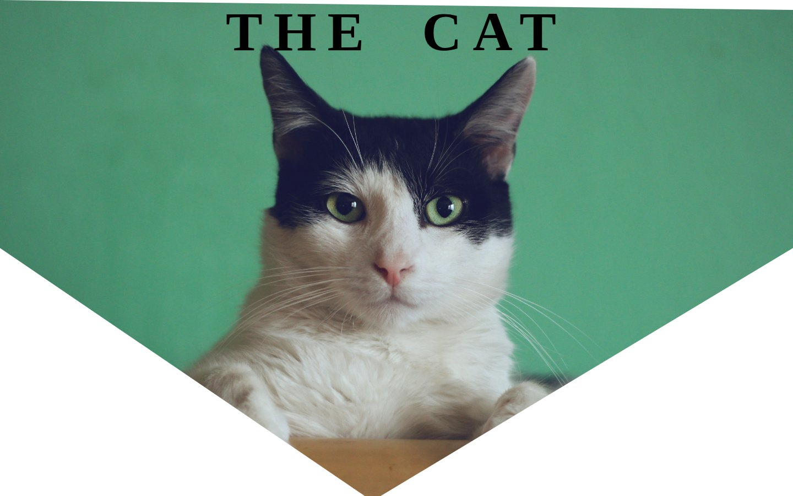

# The Cat: HTML and CSS Practice Page

A one-page CSS practice site about cats, with a V-shaped hero cut out using `clip-path`.

**Live page:** <https://shayan-abrar.github.io/Conceptual-session-1/>

<p align="center">
  
</p>

This page comes from a concept-review session and puts a handful of core CSS techniques in one place: clipping a background image with a polygon, spacing out a display headline, gradient content cards and a flexbox image row. It's short enough to read in a few minutes, so it's a handy reference for those techniques.

## Quick Start

```bash
git clone https://github.com/SHAYAN-ABRAR/Conceptual-session-1.git
cd Conceptual-session-1
python3 -m http.server 8000
```

Open <http://localhost:8000>. On Windows, use `python` instead of `python3`. Opening `index.html` directly in a browser works too. The cat photos in the "Types of Cats" row and the favicon load from Unsplash and Icons8, so you need an internet connection to see them.

## Features

- **Clipped hero:** a full-viewport background image cut into a V shape with `clip-path: polygon(...)`.
- **Display headline:** 100px text with wide `letter-spacing` and `word-spacing`.
- **Gradient cards:** the description and gallery sections sit on `linear-gradient(45deg, pink, blueviolet)` backgrounds, with dotted bottom borders under their headings.
- **Flexbox image row:** three photos side by side, spaced with `gap: 30px`.
- **Google Fonts:** body text uses Roboto Condensed.

## How the Hero Is Shaped

The V-shaped cut comes from one polygon in `style.css`. Each point is an `x y` position, so moving the `48%` and `46%` points changes where the tip of the V sits:

```css
.a {
    background-image: url(images/cat.jpg);
    height: 100vh;
    clip-path: polygon(0 0, 100% 2%, 100% 50%, 48% 100%, 46% 100%, 0% 50%);
}
```

## Limitations

- The description paragraph is placeholder (lorem ipsum) text.
- The headline uses the browser's generic `cursive` font, so it looks different on each operating system.
- `style.css` imports both Lato and Roboto Condensed, but the second `font-family` rule overrides the first, so Lato isn't used.
- The gallery images are hotlinked from Unsplash and have no `alt` text.

## Tech Stack

- HTML5
- CSS3 (`clip-path`, gradients, Flexbox)
- Google Fonts: Roboto Condensed

## Contributing

Suggestions and bug reports are welcome. Please [open an issue](https://github.com/SHAYAN-ABRAR/Conceptual-session-1/issues). Please read the license note below before reusing any code or images.

## License

This repository doesn't have a license yet, so it doesn't grant anyone permission to reuse or redistribute its code or images. Please ask before reusing any part of it. The photos in the "Types of Cats" row are hotlinked from Unsplash and remain under the Unsplash License.

---

Built by **Shayan Abrar** · [GitHub](https://github.com/SHAYAN-ABRAR) · [LinkedIn](https://www.linkedin.com/in/shayan-abrar/)
